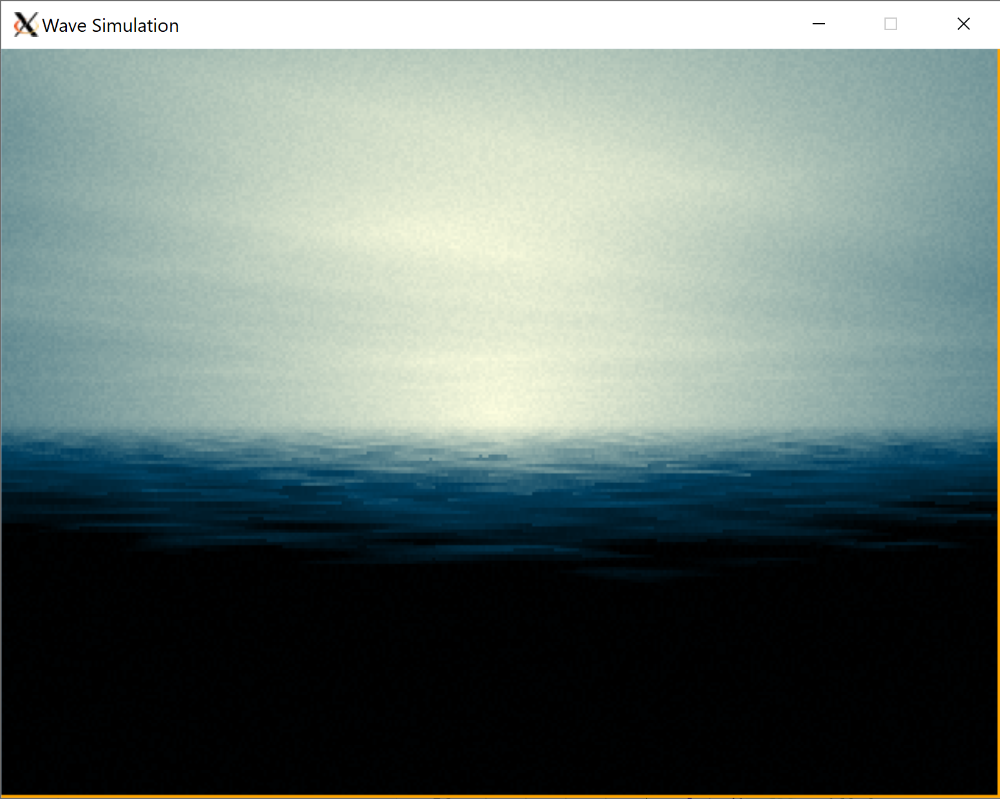

Buggy port of https://github.com/ilmenit/sizecoding/blob/main/Encounter/Encounter.md to Rust.

I can't find the *+%!@* bug >:-(

These are all images at time = 5sec:

Original

Rust, with calculated palette

Rust, with fixed palette (Thanks, ilmenit!!)

The Rust version is very different and I can't find any differences in the code.
(https://raw.githubusercontent.com/ilmenit/sizecoding/main/Encounter/encounter.cwa)
