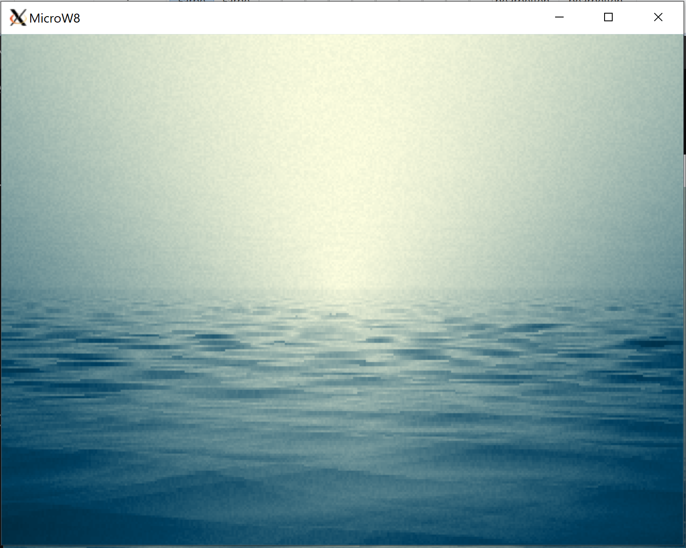
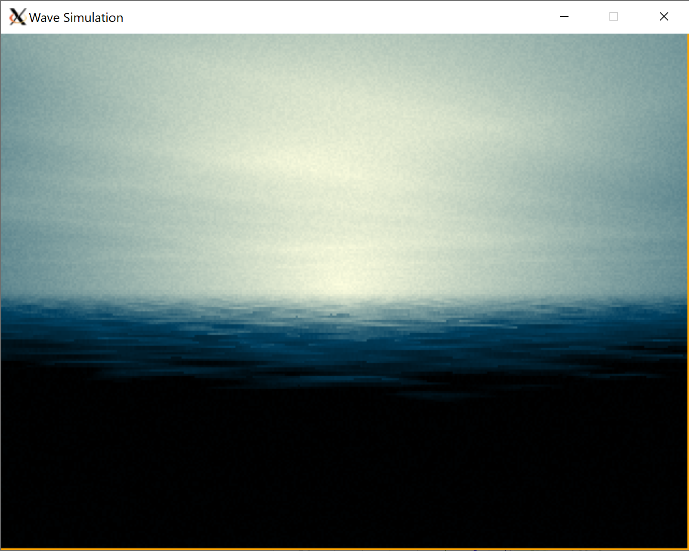

Port of https://github.com/ilmenit/sizecoding/blob/main/Encounter/Encounter.md to Rust.

The palette is precalculated (thanks, ilmenit!!!) because MicroW8 does some pixel shader magic I didn't implement. This is the difference:

These are all images at time = 5sec:

Original

Rust, with calculated palette

