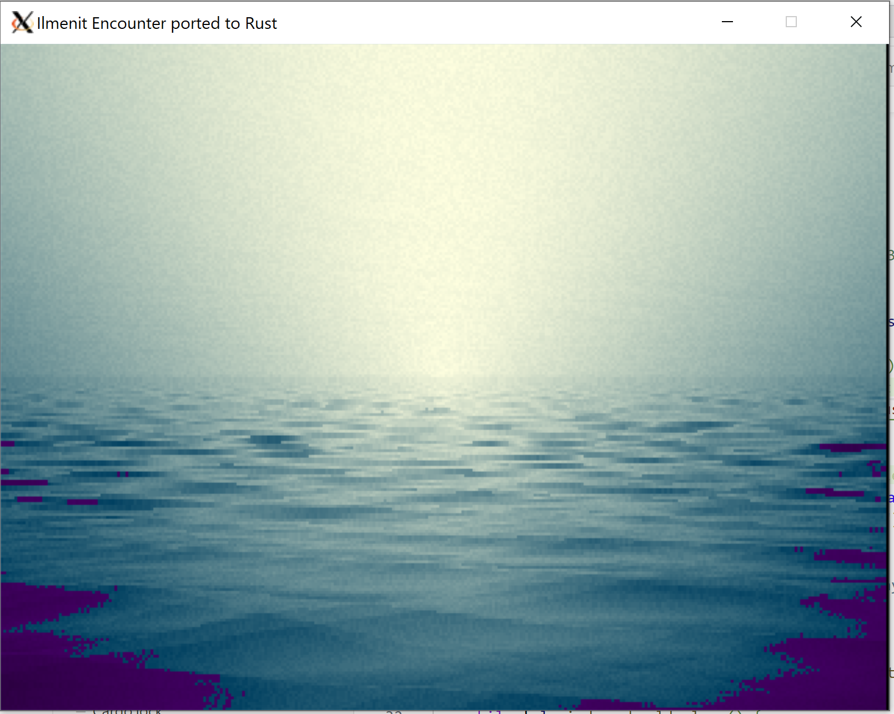

## Port of [Ilmenit's Encounter](https://github.com/ilmenit/sizecoding/blob/main/Encounter/Encounter.md) to Rust.

#### Native build + run:

    cargo build --release --bin main_raylib --features for_raylib
    ./target/release/main_raylib

#### Wasm is WIP (not working at the moment):
(Besides being WIP, it's also absurd, of course, because the wasm file is now > 10k instead of 256b. It's just for me to learn stuff)

    wasm-pack build --target web --no-typescript --features for_web_sys
    python3 -m http.server

#### Palette problems
The palette is precalculated (thanks, ilmenit!!!) because MicroW8 does some pixel shader magic I didn't implement. 

This is the difference: (images at time = 5sec)

Original

Rust, with calculated palette

